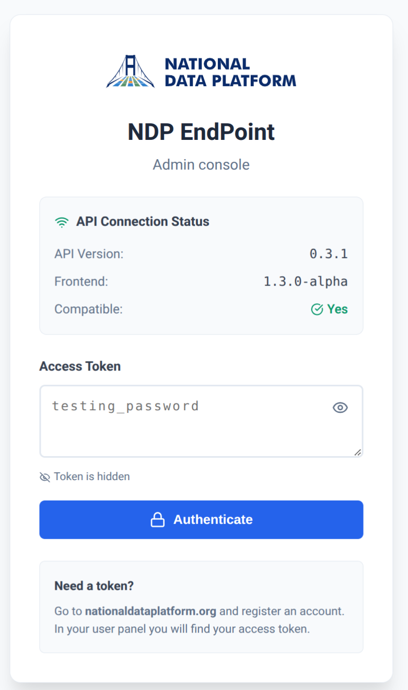
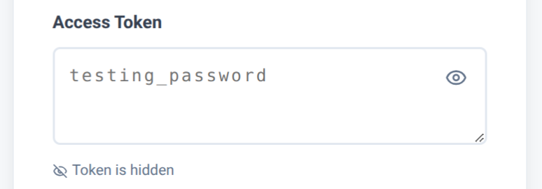
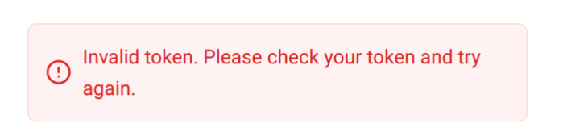
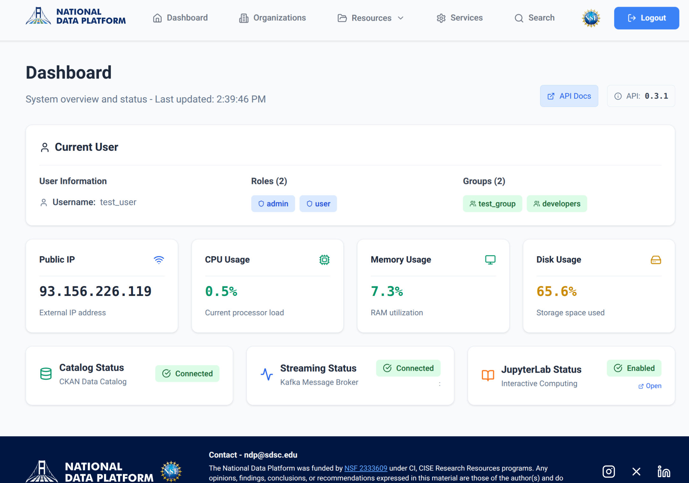

# Getting Started with the NDP-EP Frontend

This tutorial covers how to access and navigate the NDP-EP administrative console.

## Prerequisites

- Access to an NDP-EP frontend instance
- Valid authentication token
- Modern web browser (Chrome, Firefox, Safari, or Edge)

## Step 1: Accessing the Console

Open your web browser and navigate to your NDP-EP frontend URL:

```
https://your-frontend-url.com
```

You will be presented with the login screen.


<!-- SCREENSHOT NEEDED: Login screen showing the token input field and "Enter" button -->

## Step 2: Authentication

The NDP-EP console uses Bearer token authentication. To log in:

1. Obtain your authentication token from your administrator
2. Paste the token into the **Token** input field
3. Click the **Enter** button


<!-- SCREENSHOT NEEDED: Login screen with a token partially visible in the input field (you can blur/hide part of it) -->

If the token is valid, you will be redirected to the Dashboard. If invalid, an error message will appear.


<!-- SCREENSHOT NEEDED: Login screen showing an error message for invalid token (optional - only if easy to reproduce) -->

## Step 3: Dashboard Overview

After successful login, you'll see the main Dashboard. This page provides an overview of your NDP-EP instance status.


<!-- SCREENSHOT NEEDED: Full dashboard page showing all status cards and information -->

The Dashboard displays:

### System Information

- **EP Name**: The name of your EndPoint instance
- **Organization**: The organization this instance belongs to
- **API Version**: Current version of the backend API
- **Frontend Version**: Current version of the console

### Connection Status

The Dashboard shows the status of various backend services:

- **Backend**: Connection to the CKAN catalog
- **Kafka**: Streaming data service status
- **S3**: Object storage connection status
- **JupyterLab**: Notebook environment status

Each service shows either:
- **Connected** (green) - Service is available
- **Disabled** (gray) - Service is not configured
- **Error** (red) - Connection problem

## Step 4: Navigation

The main navigation menu is located at the top of the page. It provides access to all console features:

### Available Pages

| Menu Item | Description |
|-----------|-------------|
| **Dashboard** | System status overview |
| **Organizations** | Manage organizations |
| **Datasets** | Create and manage datasets |
| **Kafka Topics** | Register Kafka streaming topics |
| **URL Resources** | Register URL-based resources |
| **S3 Resources** | Register S3 object storage resources |
| **S3 Management** | Browse and manage S3 buckets/objects |
| **Services** | Register and manage microservices |
| **Search** | Search for datasets and services |

## Step 5: User Information

Your authentication status is displayed in the top-right corner of the navigation bar.

This area shows:
- Your user identifier or group
- A **Logout** button to end your session

## Step 6: Logging Out

To log out of the console:

1. Click the **Logout** button in the top-right corner
2. You will be redirected to the login screen
3. Your authentication token will be cleared from the browser

## Common Issues

### Token Expired

If your session expires, you'll see an alert message and be redirected to the login screen. Simply log in again with a valid token.

### API Connection Error

If the Dashboard shows connection errors:

1. Check that the backend API is running
2. Verify your network connection
3. Contact your administrator if the problem persists

## Next Steps

Now that you're familiar with the console, explore these tutorials:

- [Dataset Management](./02-dataset-management.md) - Create and manage datasets
- [Organizations](./03-organizations.md) - Manage organizations
- [Services](./04-services.md) - Register microservices
- [Search](./05-search.md) - Find datasets and services
